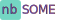

# nb SOME



A social media for students at Noroff.

## Description

Get in touch with your fellow students on a social media. 
Register or log in and update the profile picture and banner. Make posts and comment or react on other students posts. 
You can also follow/unfollow fellow students profile.


## Built With

- [API Guide](https://docs.noroff.dev/social-endpoints/authentication)
- [API Documentation](https://nf-api.onrender.com/docs/static/index.html)
- [Noroff API Documentation](https://docs.noroff.dev/)
- [React](https://react.dev)
- [Bootstrap + react Documentation](https://react-bootstrap.netlify.app/)
- [Bootstrap Documentation](https://getbootstrap.com/docs/5.3/getting-started/introduction/)
- [Reactions package](https://github.com/charkour/react-reactions)

## Getting Started

### Installing


To get the project started you need to:

1. Clone the repo:

```
git clone git@github.com:Noroff-FEU-Assignments/project-exam-2-dumblond.git
```

2. Install the dependencies:

```
npm install
```

Open a browser on http://localhost:3000

### Running


To run the app, run the following commands:

```
npm run dev
```

## Contributing

Anything isnt working?

[Submit an issue](https://github.com/Noroff-FEU-Assignments/project-exam-2-dumblond/issues/new/choose)

Fixed an error?
Fork the project and submit a [Pull request](https://github.com/Noroff-FEU-Assignments/project-exam-2-dumblond/pulls)

## Contact


[My LinkedIn page](https://www.linkedin.com/in/anne-berit-lemika-68aa4b255/)

[My github page](https://github.com/dumblond)

[My homepage](https://nbdesign.no/index.html)


---

# Project exam 2 report

## Table of Contents
1. [Summary of the project](#1-summary-of-the-project)
2. [Run the project locally](#2-run-the-project-locally)
3. [Make a project plan](#3-make-a-project-plan)
4. [API and audience research](#4-api-and-audience-research)
5. [Styles](#5-styles)
6. [Design prototype](#6-design-prototype)
7. [User testing](#7-user-testing)
    1. [User test #1 demo from XD](#71-user-test-1-demo-from-xd)
        1. [User test #1 answer one](#711-user-test-1-answer-one)
        2. [User test #1 answer two](#712-user-test-1-answer-two)
    2. [User test #2 live page on netlify](#72-user-test-2-live-page-on-netlify)
        1. [User test #2 answer one](#721-user-test-2-answer-one)
        2. [User test #2 answer two](#722-user-test-2-answer-two)
8. [Developing](#8-developing)
9. [Resources](#9-resources)


## 1. Summary of the project

The assignments goal is to:

*To take the skills learned over the last two years and take on an extensive project where the finished product should reflect the candidate's general development capabilities, in addition to visual and technical skills*

This has been a really challenging project. To take all the skills you have learned in the past four years ( I study part-time ) is a big task. 

I wanted a clean site with bright colors on it. 

I think the biggest challenge is that you can't control what's on the API and that I can't do anything with the setup. But I think I've got a very good page based on the foundation I've had to work with.

We had to make some choices about which products to use, I have chosen to use these:
- JavaScript Frameworks, React (>16)
- CSS Frameworks, Bootstrap (>5)
- Hosting Services, Netlify
- Design Applications, Adobe XD
- Planning Applications, GitHub Projects


## 2. Run the project locally

To run the project locally you first have to clone the repositary from github, and run

npm install

npm run dev


## 3. Make a project plan

After reading the aproved resources list I had to change from the program I normally make a project plan in, to one on the list. I decided to use github's solution, as it was most similar to the way I like to work.

I tried to include everything we have learned into the planning.
The setup is in four phases
1. Planning (includes project in github, logo, typgraphy, buttons and colors decisions)
2. Testing (make a prototype in Adobe XD and let it be tested. Also test the page after developing)
3. Developing (before and after usertesting)
4. Delivery (style guide, this report and delivery)


## 4. API and audience research

Users of the site are students, and since I myself am a student at Noroff, the user survey was really not that difficult. 
I checked many social medias to see how the setup of the post/comments and profiles is, and I tried to take the function I liked with me too my own social media page. 
I used postman to get the API information, to see what it contained of information. 


## 5. Styles

The brand of the assignment is nbSOME, that stands for nb designs social media. I wanted a "crazy" color in the logo. I tested with pink on green at the Adobe XD version, but I had to change the pink to purple when I started on the developing and testing for colorblindness. 
The colors are fresh and young. And the typography I went for are fresh and easy to read. 


## 6. Design prototype

I used Adobe XD to make the design prototype. I made it to small screens, because social media is often used on the phone. After I had made the prototype I sent it to user testing. 


## 7. User testing

I sent out the two user test to the same four people. I only got answers from 2 of the four on both testes. 
The #1 usertest was of the design prototype site that I made in adobe XD. 

The #2 usertest was of the developed site that I had published via netlify.


### 7.1 User test #1 demo from XD

This is the message I sent out to my four testers: 

Hello,  

I hope you have the opportunity to help me with a user perspective on my final thesis.
We have been given the task of creating a social media 

The content of the task, i.e. the user profiles and the posts, will be retrieved from an API, so I have not emphasized that in my demo.
 
The demo is designed for a small mobile screen, so if you have a large mobile screen, I recommend that you rather watch the demo on a PC/iPad. (Not all buttons work, but that's not important)

What I want from you is that you press back and forth a bit in the demo that I have made, and give me feedback on:
- The logo (colours/appearance)
- The menu (content and form)
- Footer (bottom of page) (color, size)
- Buttons (Color, Position)
- General layout (colour, size of things, location)
- Do you think the pages are user-friendly and easy to navigate? If not, what would you like differently?

Link to demo page:
 
If something is unclear, just ask, and if you don't have the time/willingness to help, it's all right 😊


#### 7.1.1 User test #1 answer one

- The login page works well, easy to see where you have to press to proceed.
- Nice colors - both the green and the pink. In the logo, pink writing on top of green may be difficult for some to read
- Perhaps the menu should not be displayed until you are logged in? That means it may not need to be included on the login page?
- The menu choices are simple and user-friendly - but perhaps my profile should simply be called "me" instead
- Easy to understand how to comment on a post - it is very self-explanatory
- I can't quite decide whether the pink color of the "view post" is good, or whether it should have a slightly darker color
- Inside my profile, the individual posts could have been boxed a bit so that they are more separated from each other
- Otherwise, my profile works well, fine with the picture at the top and name
- Do you like the green color at the bottom of the page a little better than the green color at the top of the page - perhaps the green color should be the same both top and bottom to have a consistent color?
- The text size is consistently good


#### 7.1.2 User test #1 answer two

- Functional like that, I think it's nice! - Plain and simple to understand where I have to press/click, and easy to find. so the comments I have relate to the design - the visuals themselves.
- And I emphasize the things that I think can be improved, since I expect that you will benefit from them - not on what is nice.
- The contrast between the two colors in the logo is not quite good. They have a very similar value (darkness) so that there is a slight flicker between them. It occurs when only the hue separates two colors. A flicker like that can have its place, but most people perceive it as disturbing and unpleasant, and I don't think you want it here.
- If you squint at the logo you will see that it is difficult to read the letters. I don't think the contrast satisfies the UU requirements, and colorblind people probably can't read "nb".
- Should you have included a "Help" point in the menu, which explains the different buttons? - Although they are fairly self-explanatory.
- I wonder about the pink color. I think many people will perceive it as very "girly", and maybe it will cause resistance for cis male users? But in that case it should be tested on a handful of possible users - and if the target group is e.g. young women, it is not a problem.
- The font in the footer is small. There, the details disappear a little with a serif font. I would choose the same grotesque (sans-serif) that you have used in the rest of the design.
- In the menu, it is a bit strange with the Log out button. It is nice that it differs from the others, but now it is both small print and that it is in a yellow "button-within-a-button". It should be less obvious than the other buttons, as it is the one that is least likely to be clicked. Maybe it should just have a smaller font - but not quite as small as now - and be at the bottom of the screen?
- So to the last thing, which is a real detail geek: The rounded rectangles in the menu have contours that are very thin - like hairlines. It works fine, but when they are next to each other, the line between the buttons becomes thicker than the line around the buttons. It will hurt a bit. I would have either made the lines a bit thicker so that they have an actual visual thickness, say 2px, but then put the buttons with the lines overlapping in the menu stack so that the line between the buttons is also only 2px thick
or have some air between the buttons so that they are not right next to each other.
- Hope this helps. Just ask if there is anything that is unclear, or something you are wondering about that I have not answered.


### 7.2 User test #2 live page on netlify

This is the message I sent out to my four testers:

Hello,  

Then I'm done with my social media page, and hope you have the opportunity to help with testing. 

According to the assignment, we must fulfill these criteria,  

1. A user with a stud.noroff.no email address must be able to register  
2. A registered user must be able to  
    - Log in and log out  
    - Update your own avatar and banner  
    - See a list of posts  
    - See a list of profiles  
    - Look at a single record  
    - View a single profile  
    - Create a record, be able to update this and delete it  
    - Could comment on records  
    - Could react with an emoji to a post  
    - Could follow/unfollow another profile  

Fully understand that you don't have time to test all the features, but great if you have time to test something and give feedback on;  
- Ease of use, is it easy to navigate/understand what to press?  
- What do you think about the colors and appearance of the page?  
- Other things you would like to give feedback on?  

Either you can create your own user, (the email field must contain stud.noroff.no, and does not have to be a real email) or you can use one of the test users that I created:  

Username: ABLusertesting@stud.noroff.no  
Password:  

Note: The profiles and posts have been created by other students, so unfortunately I cannot control the content of these, but I have created an avatar and banner image that appears on those who have not added this to their profile.  

Link to the page, it should work on all types of devices:  
Many thanks in advance for your help! 😊 


#### 7.2.1 User test #2 answer one

- Clear first page, but should turn so that you have to press to expand the buttons (I have an account and Do not have an account), now they come with an expanded view first
- A bit confusing with the button "Do not have an account" in the middle, and at the top right there is "Register FORm" - they end up on the same registration page, right? Do you agree with one of them?
- Neat page, well ventilated and easy to read the text
- After logging in and on my page "My Profile" on the left is perhaps a bit big? And could have been more central?
- The posts are well placed, and in good order with a bit of air between each one
- Easy to leave a comment or applause etc. - recognizable from other social media - that's an advantage because then you immediately understand how it works
- Easy to edit / delete own posts - that's good
- Would it be smart to have a search field where you could search for other profiles?
- Max 280 characters in posts - is there a reason for 280? 
- Very easy to add url / images
- Should there be a standard size for the images in posts? Now there are many variants, making it a bit messy (but that's a detail then)
- Easy to register as a new user
- Missing function to be sent a new password if you have forgotten/lost it
- Can't quite change the Banner Url, but maybe the URL must be internal or something?
- Would there have been a list of all the profiles? How can you find a specific profile?
- If I follow someone, should they appear at the top of profiles or first on the latest posts?
- I can't find anywhere to see which profiles I follow
- Otherwise user-friendly and easy to navigate


#### 7.2.2. User test #2 answer two

My profile:
- Does not preserve the proportions in avatar image.
- I would also like to be able to upload a picture. It's not quite kosher to refer to other domains, is it?

Latest posts:
- I can react many times to a post - so Oliver has now got 105 party store houses on his test post...

Make a post:
- Missing the opportunity to upload pictures here too. A little less user-friendly to be able to just paste in a url - but maybe that falls outside of what you have time and opportunity to include?

Otherwise, it was clear and easy to find. Bright and nice design!


## 8. Developing

When I started the developing it became clear to me that I couldn't use the pink color that I had in the Adobe XD demo, the color was not good on the page. I decided to use a purple color instead of. The user testers had given me feedback on the color on the Adobe XD version, so they where happy that the pink color disappeared. But i kept the pink color in the favicon, because the nb letters shows better. I also changed the green color in the footer and in the buttons, because the WCAG test of the page showed that the contrast ratio was not good enough. But I liked the darker green color I have used. 

After I had imported the logo and created the navbar, I created the cards and started to retrieve information that was in the API on posts. The information was a little demotivating. 
I had hoped that the students had left a slightly better title and body text on their posts. But you have to work with what you got, and after making the post detail page, I started on the Profile pages. There isn't much information on the profile API so it was okey to present. I decided to have a default banner and avatar picture on the profiles, because many profiles did not have either, and the page looks much better with som pictures on it. 

Made a home page with a login og register page, in the beginning I had it so you could register with both noroff.no and stud.noroff.no because it was allowed in the API 
documentation, but the assignment says that it is only for stud.noroff.no so I removed noroff.no as a posibility. I don't like that the API doesn't give you the option to log in straight after you've registered, but I think I did the best I could based on what's possible. When you log in you come to my profile page, I like that.

Then I started on the my profile page. To update the content and present my posts. I also started on make a post. I desided to put it on the top of the latest post page, as a button with a Form. Both the title and the body have a max of 280 characters in the API. The only required field in the API is title, but I made body also required. 
Made the edit post and delete post, before I started on the comments. 

Comments are only made as a field to fill out and gets posted when you click enter. The reactions was a challenge. I started out with only one icon, but after testing it and after I saw how much information was in the API on it, I ended up being able to choose different icons, and to present all the icons that the post had received. I like the reaction function. All of the testers have comment on that there is no restriction on how many reaction you can make, but the API allows everything.

At this point I started to link the profile and posts, so that when you are on a profile, you will see all the posts that the user has made and that you can go into the post to read more and see comments.

After this I started on follow and unfollow buttons, where I list the followers and the following API information.

Overall I am really happy with the developing, I got some really good user feedback that helped me on the way, most of the things they didn't like on the page I had developed, is things that I can't change because it is a limitation of the API.


## 9. Resources

- [API Guide](https://docs.noroff.dev/social-endpoints/authentication)
- [API Documentation](https://nf-api.onrender.com/docs/static/index.html)
- [Noroff API Documentation](https://docs.noroff.dev/)
- [Bootstrap + react Documentation](https://react-bootstrap.netlify.app/)
- [Bootstrap Documentation](https://getbootstrap.com/docs/5.3/getting-started/introduction/)
- [Google fonts](https://fonts.google.com/)
- [Avatar picture](https://pixabay.com/no/vectors/avatar-nebb-svart-s%C3%B8t-f%C3%B8lelse-1295429/)
- [Banner picture](https://pixabay.com/no/vectors/%C3%B8rken-kaktus-natur-tegning-skisse-6814275/)
- [Reactions package](https://github.com/charkour/react-reactions)
- [Postman](https://www.postman.com/)

